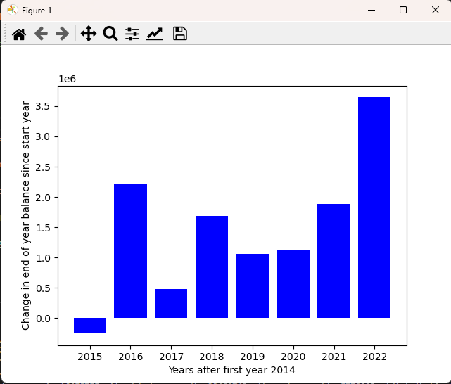

<div>
  
</div>

## This Repo is part of the TIFrific project for IPRO 497 at the Illinois Institute of Technology
# Improving Chicago’s Fiscal Transparency By Extracting Historical Financial Data Through a Machine Learning Pipeline

Since 1986, approximately $25 billion dollars of property tax revenue collected from Chicago property owners has been diverted into Chicago's district-based [Tax Increment Financing program](https://tifreports.com/illinois-illumination). TIFs currently cover [roughly 33% of the City of Chicago](https://chicagopolicyreview.org/2023/04/13/redevelopment-for-who-how-tif-redistributes-public-funds-to-the-wealthy/). Transparency is imperative for good governance and civic involvement in decisions regarding the TIF funds considering their property taxes could be used towards potential projects which provide little community support. The lack of data has caused TIFs to face scrutiny over concerns regarding the [transparency of investment allocation](https://socialistworker.org/2017/07/27/protesting-another-tif-theft-in-chicago). Prior to 2010, TIF district data had been archived using digital scans rather than direct computer entry, reducing accessibility for analytical purposes. Although an [existing dataset](https://github.com/philipayates/chicago2022TIF) has been made by [Phillip Yates](https://github.com/philipayates). Our project outlines an algorithmic approach to extracting, organizing, and hosting Chicago TIF records dating back to 1997. We developed an automated “document to data” pipeline by leveraging Optical Character Recognition, Machine Learning, and parsing algorithms technologies to perform direct data extraction from the scanned documents. We are currently hosting the existing Chicago TIF data via AWS RDS, allowing for seamlessly integrating newly extracted data, ensuring comprehensive and up-to-date records. Through this work, we hope to improve transparency, accountability, and informed civic engagement in Chicago, thereby supporting equitable urban growth.</p>


# IRPODS497-Data-Tools

<p>DataTools contains the relevant tools for connecting to the TIF database currently up, an example query, and several specific tools for preliminary data analysis.</p>

<h2>CONNECTING TO DATABASE</h2>
<p>An example Database connection, and the one used by all relevant tools, is handeled by <i>establishConnection.py</i></p>. 
<p>To use <i>establishConnection.py</i>, you will need to clone this repo, and then provide database credentials.</p>

<h4>Linux:</h4>

```
$ git clone https://github.com/TIFScrapingOrg/DataTools
$ touch awscreds.csv
```

<h4>Windows:</h4>

```
$ git clone https://github.com/TIFScrapingOrg/DataTools
$ start notepad awscreds.csv
```

<p>From here, you will have to enter in the database endpoint and relevant credentials to access the DB. If you do not have these credentials and believe you should, please message one of the members of TIFrific! We are working on a User Provisioning system for public use.</p>
<p>Proceed to open the CSV and fill it out as below:</p>

`tifproject.cruoe42s86b2.us-east-2.rds.amazonaws.com,[YOUR_USERNAME],[YOUR_PASSWORD]`

<p>From here, <i>establishConnection.py</i> will be used for the connections to the Database. Primarily, this is done through the main.py code</p>


<h2>USING ANALYSIS TOOLS</h2>
<p>The other part of this repo is a few tools we have for showing some basic graphs, charts and linear regressions.</p>
<p>In the <b>utils</b> folder, you'll find functions to get items such as the net income or average growth of a specified tif, as well as <em>exe.py</em>, which will execute relevant statements. Keep in mind, the connected user is a read-only user, so you cannot add or remove data with it.</p>
<p>In the <b>table</b> folder, you will find <em>getRegression.py</em> and <em>getTable.py</em>. <em>getRegression.py</em> creates a regression analysis table for the specified district and variables, and <em>getTable.py</em> creates a table of two specified variables for a selected district.</p>
<p>In the <b>graphing</b> folder, you'll find <em>makeGraph.py</em>, which will take a table and plot a graph for it.</p>
<div>
  
</div>

<div>
  
</div>

# Project Name

> Brief description of the project's purpose and scope.

---
## Table of Contents
- [Introduction](#introduction)
- [Getting Started](#getting-started)
- [Usage](#usage)
- [Features](#features)
- [Visualizations](#visualizations)
- [Contributing](#contributing)
- [Credits](#credits)
- [License](#license)
- [Conclusion + Future Work](#conclusion)
---

## Introduction
<p>Since 1986, approximately $25 billion dollars of property tax revenue collected from Chicago property owners has been diverted into Chicago's district-based [Tax Increment Financing program](https://tifreports.com/illinois-illumination). TIFs currently cover [roughly 33% of the City of Chicago](https://chicagopolicyreview.org/2023/04/13/redevelopment-for-who-how-tif-redistributes-public-funds-to-the-wealthy/). Transparency is imperative for good governance and civic involvement in decisions regarding the TIF funds considering their property taxes could be used towards potential projects which provide little community support. The lack of data has caused TIFs to face scrutiny over concerns regarding the [transparency of investment allocation](https://socialistworker.org/2017/07/27/protesting-another-tif-theft-in-chicago). Prior to 2010, TIF district data had been archived using digital scans rather than direct computer entry, reducing accessibility for analytical purposes. Although an [existing dataset](https://github.com/philipayates/chicago2022TIF) has been made by [Phillip Yates](https://github.com/philipayates). Our project outlines an algorithmic approach to extracting, organizing, and hosting Chicago TIF records dating back to 1997. We developed an automated “document to data” pipeline by leveraging Optical Character Recognition, Machine Learning, and parsing algorithms technologies to perform direct data extraction from the scanned documents. We are currently hosting the existing Chicago TIF data via AWS RDS, allowing for seamlessly integrating newly extracted data, ensuring comprehensive and up-to-date records. Through this work, we hope to improve transparency, accountability, and informed civic engagement in Chicago, thereby supporting equitable urban growth.</p>


## Getting Started
#### Prerequisites
- List of technologies, libraries, or tools required to run the project.
- Installation instructions for each prerequisite.


#### Installation
- Step-by-step guide on setting up a local development environment.


## Usage
Instructions on how to use the project, including basic commands and examples.


## Project Feature 1 - Developed in [Technology 1](Technology-1-URL) using [Framework 1](Framework-1-URL)

For users familiar with [Technology 1], code is provided to run locally. You will need additional files found in the folder `additional_files_folder` as well as specific data files (`data_file.csv`) and the `project_logo_2.jpeg` file. The application is named `App_Name.R`. Be sure to save all files in the same directory.

#### Visualizations for Project feature 1

Here, provide links to additional documents or folders that contain:
- Graphs and figures illustrating important aspects of the project.
- Data tables showing key data used or generated by the project.
- Any other relevant visual content.

[See Visualizations](link-to-visualization-folder-or-file)


## Project Feature 2 - Developed in [Technology 2](https://developer.mozilla.org/en-US/docs/Web/JavaScript/Reference) using [Framework 2](https://example-framework.com/)

The application is published publicly at this URL: 
  - [Hosted Application URL](https://example.com/secondapp)

#### Visualizations for Project feature 2

Here, provide links to additional documents or folders that contain:
- Graphs and figures illustrating important aspects of the project.
- Data tables showing key data used or generated by the project.
- Any other relevant visual content.

[See Visualizations](link-to-visualization-folder-or-file)