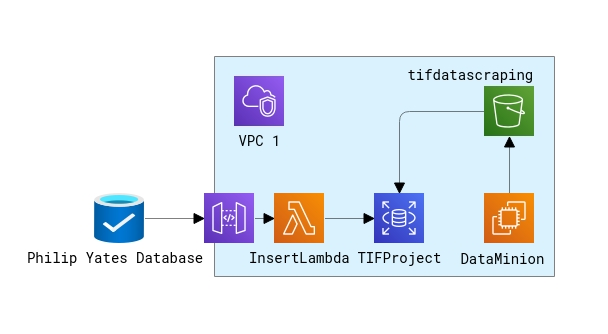

# Chicago TIF Accessibility Project - An Illinois Institute of Technology IPRO Project

## What are TIFs
Tax Increment Financing (TIF) districts are districts in Chicago that are created by the city with the goal of improving the lives and economy of people in the district. This is done through collecting property tax for a period of at minimum 23 years.

- [TIF Program Guide](https://www.chicago.gov/content/dam/city/depts/dcd/general/2020_tif_program_guide.pdf)
- [Chicago TIF Portal](https://www.chicago.gov/city/en/depts/dcd/provdrs/tif.html)

## Previous Work in This Area
We based our work on trying to expand the [Chicago 2022 TIF Data Project](https://github.com/philipayates/chicago2022TIF) created through a collaboration between the MCDC Project and The CivicLab

## Chicago TIF Accessibility Project
Our project focused on turning TIF financial data into an easily accessible digital format. There are two ways to access this data.

### Database Queries
We have set up a publicly accessible database and created tools to query into it.

### CSV File
Also available is a CSV file containing the same data in the public database. It is organized in the same way the the philipyayates data is organized

### How is the infrastructure set up and how do I access it

This project is set up with the support of AWS infrastructure. This includes an S3 Bucket, an RDS instance, an EC2 instance, and a Lambda function. The Simple Secure Storage (S3) bucket was used for holding incomplete data pieces, as well as the PDFs themselves. The AWS Relational Database Service (RDS) instance is running the MySQL 8.0 engine and is a publically accessible database used to hold the relevant data in an up-to-date capacity. The endpoint for the RDS is ` tifproject.cruoe42s86b2.us-east-2.rds.amazonaws.com ` . The Elastic Compute Cloud (EC2) instance is running assorted tasks for uploading and cleaning data within the Cloud environment. The Lambda function is used for ingesting data from previous works, such as that of the  [Chicago 2022 TIF Data Project](https://github.com/philipayates/chicago2022TIF) into our own database.

Access to the RDS is provided via a read-only user. The read-only users are password protected, but that password can be provided by contacting any group member. 

## How to query the database
...Grab that data!

## How is the CSV File Organized
Since our data is based off of the philipyayates database, the CSV shares the same format. The format is based on the table [here](https://github.com/philipayates/chicago2022TIF/?tab=readme-ov-file#what-are-these-variables)

| Variable                               | Explanation                                 |
| -------------------------------------- | ------------------------------------------- |
| **Current Data Year**                  | The year that the current data is from. |
| **TIF District Name**                  | The name of this TIF District. |
| **TIF District Number**                | The number of this TIF District. |
| **Property Tax Extraction**            | The amount of property tax collected this year (within the TIF District). |
| **Transfers In**                       | The amount transferred into this TIF District from neighboring TIF Districts this year. |
| **Transfers Out**                      | Amount of funds transferred out of the account and ported to a neighboring TIF District. |
| **Expenses**                           | The Total Expenditures. The amount of money spent on projects applicable to the TIF. |
| **Fund Balance End**                   | Balance of this TIF District's Fund at the end of the Current Data Year. |
| **Surplus Distribution**               | Disbursement of surplus funds. This is often directed to the Treasurer for reallocation elsewhere. |
| **Possible Errors**                    | Because of how the data is collected, some data failed to be validated. This is a list of possible errors or warning related to this specific year/tif if there are any errors. |
